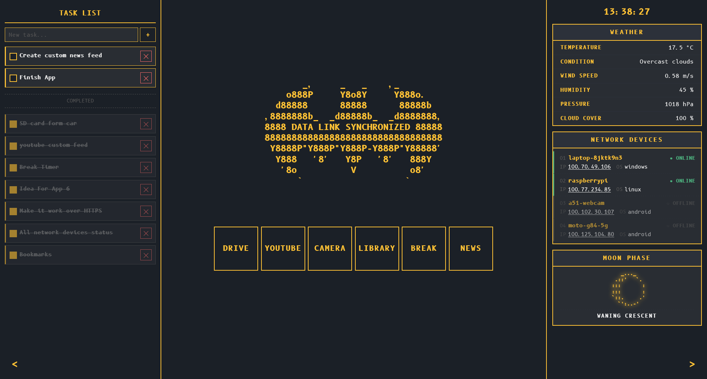
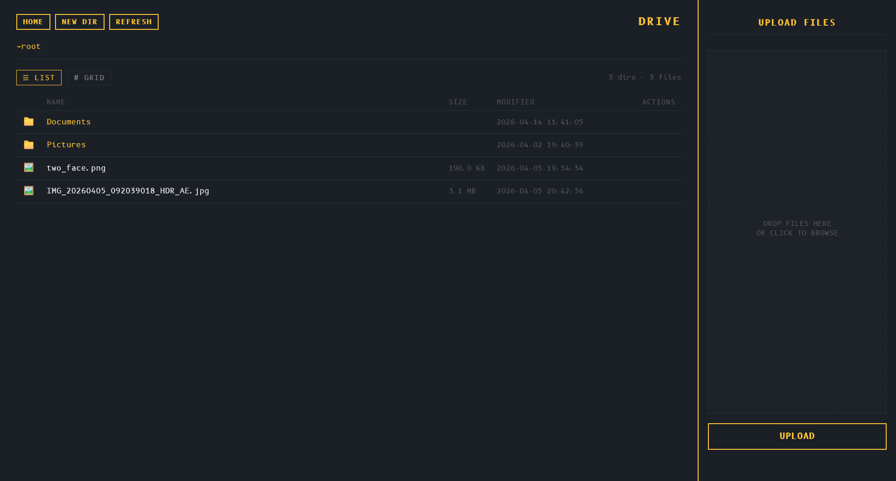
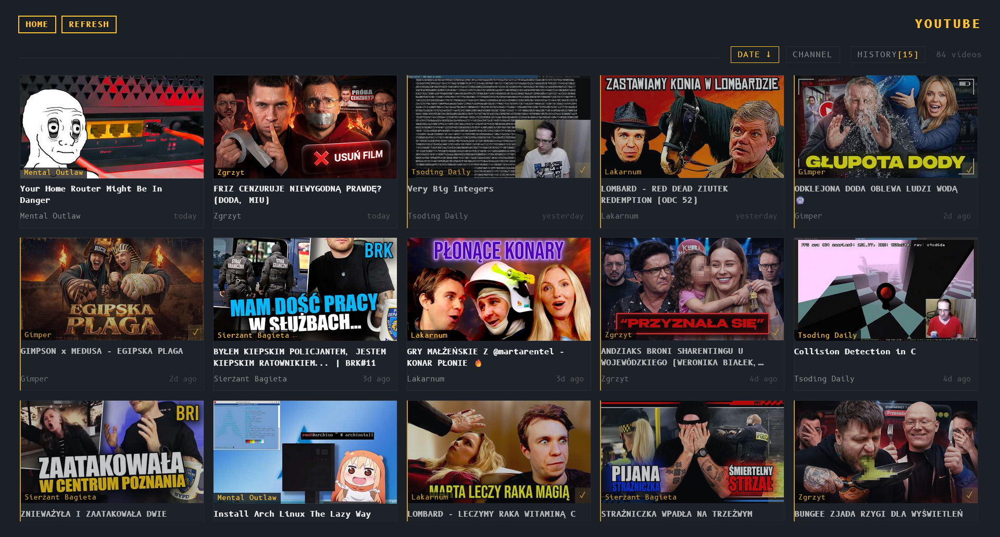

## c0p caVe

### Goal

The goal of this project is to create all in one application that will serve all my digital needs. Custom youtube and news feed, drive, bookmarks library, "pomodoro timer", IP cameras etc. All in one place, accessible on all my logged devices.

### Tech stack

 - [`Tailscale`](https://tailscale.com/) - this is the best option I know for easy to set up secure connection between network devices. Everything in the app goes through this "VPN". All connections are encrypted by default, but for full compatibility I used HTTPS certificates.
 - [`Flask`](https://flask.palletsprojects.com/en/stable/)
 - Python
 - HTML
 - CSS

### Why this way

Companies wants more and more money for same bullshit I can do on my own. No more paying for few GBs of storage. No more paying with my precious time scrolling on random feed, when I can create my own with fewer, but more accurate information. 

### Feature upgrades:

 - Fully custom and filtered news feed (maybe custom algorithm)
 - Calendar (even tho I really like google one)
 - SSH with some devices
 - more apps/functions I came up along the way

### Already implemented

Main page with tailed buttons directing to each app. On side panels there are: TODO list, weather, network device list, current moon phase.



Drive functions similarly to Google Drive or any other cloud based drive. uploading is as easy as dragging files into drop zone.



Custom YouTube feed with only up to 15 new videos from channels I chose to watch.



Basic bookmark library with tags.


Additionally, there is a break timer to stare at wall for 20 minutes straight.

### How to setup

First of all you need some device to run it on. The best option is some machine that will be always connected to the internet.

On all devices where app should be accessible, [`Tailscale`](https://tailscale.com/) has to be installed and enabled/working. 

The backend for the device for all functionality, like drive, tasks database etc. will be available soon under [there]().

### Running the application.

Create a service for the application.

```systemd
# /etc/systemd/system/c0pcave.service

[Unit]
Description=c0p CaVe
After=network.target tailscaled.service

[Service]
User=c0pcave
Group=c0pcave
WorkingDirectory=/home/c0pson/c0p_caVe
ExecStart=/home/c0pson/c0p_caVe/.venv/bin/python /home/c0pson/c0p_caVe/main.py
Restart=always
RestartSec=5

[Install]
WantedBy=multi-user.target
```

```bash
sudo systemctl daemon-reexec
sudo systemctl daemon-reload

sudo systemctl enable --now c0pcave.service
sudo systemctl status c0pcave.service
```

If everything went fine there should be something like this

```
● c0pcave.service - c0p CaVe
     Loaded: loaded (/etc/systemd/system/c0pcave.service; enabled; preset: enabled)
     Active: active (running) since Tue 2026-04-14 12:34:56 UTC; 5s ago
   Main PID: 1234 (python)
      Tasks: 1 (limit: 4915)
     Memory: 15.2M
        CPU: 120ms
     CGroup: /system.slice/c0pcave.service
             └─1234 /home/c0pson/c0p_caVe/.venv/bin/python main.py
```
